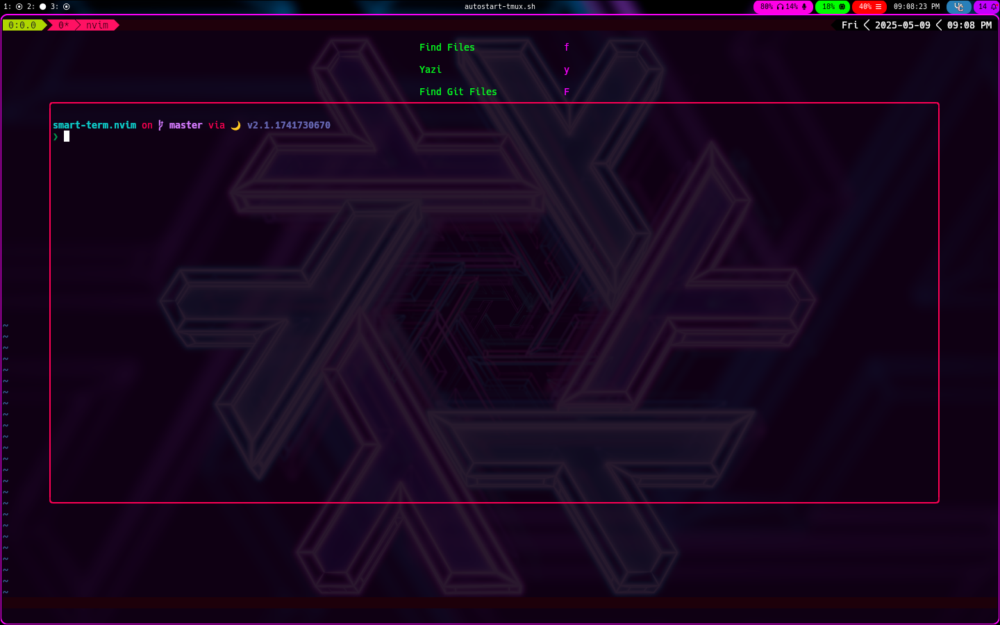
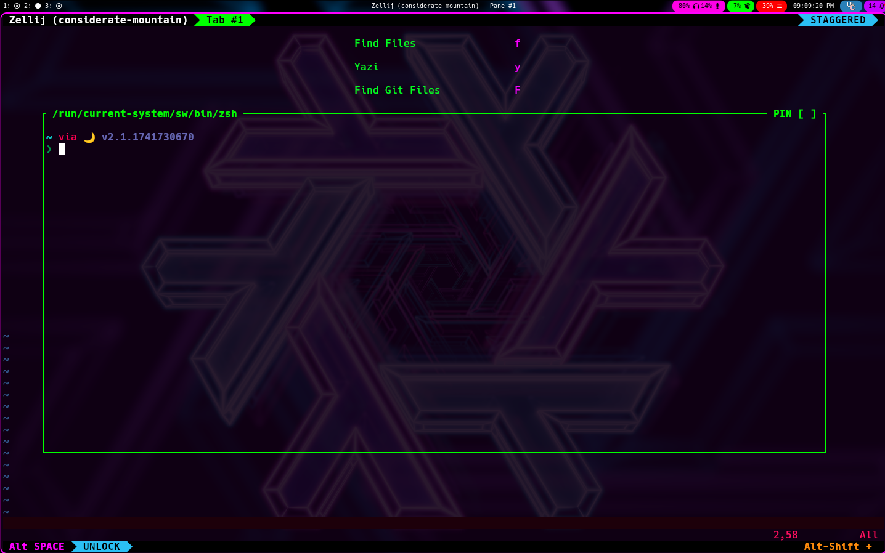
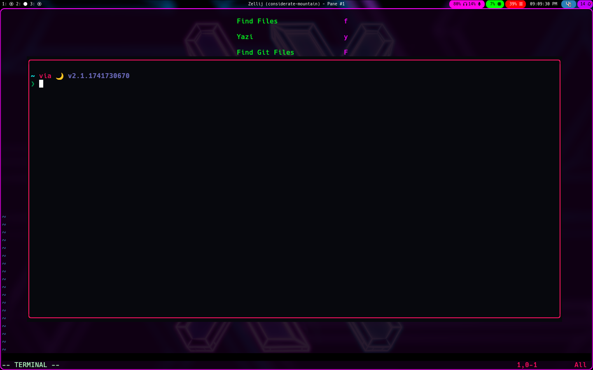

# A Neovim terminal plugin on crack! <!-- {{{ -->

Open a process or a shell easily as a:

- [x] float
- [x] splits
- [ ] new tab

That can use:

- [x] Neovim's default built in windows
- [x] Zellij's built-in windows
- [x] Tmux's built-in windows
- [ ] Kitty's built-in windows
- [ ] wezterm's built-in windows
<!-- }}} -->

## Setup: <!--{{{-->

Using lazy.nvim:

```lua
    {
        "ingenarel/smart-term.nvim",
        config = {
            floatHeightPercentage = 70, --optional for floating windows height percentage
            floatWidthPercentage = 80, --optional for floating windows width percentage

            splitHeightPercentage = 33, --optional for split panes height percentage
            splitWidthPercentage = 33, --optional for split panes width percentage

            floatNeovimXoffset = -2, --optional for floating neovim panes X offset by chars
            floatNeovimYoffset = -2, --optional for floating neovim panes Y offset by chars

            floatTmuxXoffset = -2, --optional for floating tmux panes X offset by chars
            floatTmuxYoffset = -2, --optional for floating tmux panes Y offset by chars

            floatZellijXoffset = -2, --optional for floating zellij panes X offset by chars
            floatZellijYoffset = 2, --optional for floating zellij panes Y offset by chars
        },
    }
```
<!--}}}-->

## Using:

This plugin is in heavy development so the docs could be outdated a bit. You
should check the [meta file](lua/smart-term/meta.lua) for the most up-to-date
docs

<details>
    <summary> Floating panes  </summary> <!--{{{-->

<details>
    <summary> Open a floating terminal, depending on your environment:</summary> <!--{{{-->

```lua
    require("smart-term").float{
        "btop", -- optional command, if not specified, opens the current $SHELL instead
        -- command = "btop", -- you can also use command="command", instead of using the first item as a command
        closeOnExit = true, -- if true, close the pane when the command exists,
        heightPercentage = 70, --optional height percentage
        widthPercentage = 70, --optional width percentage
        xOffset = -2, --optional for floating panes X offset by chars
        yOffset = -2, --optional for floating panes Y offset by chars
        stopVim = false, --optional if you want to stop nvim when the pane is running (works only for tmux and zellij)
    }
```

This function, in turn, calls either `nvim.float()` or
`tmux.float()` or `zellij.float()` function

</details> <!--}}}-->

<details>
    <summary> Open a floating terminal, using Neovim's built-in terminal:</summary> <!--{{{-->

```lua
    require("smart-term.neovim").float {
        "btop", -- optional command, if not specified, opens the current $SHELL instead
        -- command = "btop", -- you can also use command="command", instead of using the first item as a command
        closeOnExit = true, -- if true, close the pane when the command exists, default is true
        heightPercentage = 70, --optional height percentage, default is 70
        widthPercentage = 80, --optional width percentage, default is 80
        xOffset = -2, --optional for floating neovim panes X offset by chars, default is -2
        yOffset = -2, --optional for floating neovim panes Y offset by chars, default is -2
    }
```

</details> <!--}}}-->

<details>
    <summary> Open a floating terminal, using tmux's display-popup</summary> <!--{{{-->

```lua
    require("smart-term.tmux").float{
        "btop", -- optional command, if not specified, opens the current $SHELL instead
        -- command = "btop", -- you can also use command="command", instead of using the first item as a command
        closeOnExit = true, -- if true, close the pane when the command exists,
        heightPercentage = 70, --optional height percentage, default is 70
        widthPercentage = 80, --optional width percentage, default is 80
        xOffset = -2, --optional for floating tmux panes X offset by chars, default is -2
        yOffset = -2, --optional for floating tmux panes Y offset by chars, default is -2
        stopVim = false, --optional if you want to stop nvim when the pane is running
    }
```

</details> <!--}}}-->

<details>
    <summary> Open a floating terminal, using zellij's --floating feature </summary> <!--{{{-->

```lua
    require("smart-term.zellij").float{
        "btop", -- optional command, if not specified, opens the current $SHELL instead
        -- command = "btop", -- you can also use command="command", instead of using the first item as a command
        closeOnExit = true, -- if true, close the pane when the command exists,
        heightPercentage = 70, --optional height percentage, default is 70
        widthPercentage = 80, --optional width percentage, default is 80
        xOffset = -2, --optional for floating zelij panes X offset by chars, default is -2
        yOffset = 2, --optional for floating zelij panes Y offset by chars, default is -2
        stopVim = false, --optional if you want to stop nvim when the pane is running
    }
```

</details> <!--}}}-->

</details> <!--}}}-->

<details>
    <summary> Split panes </summary>

<details>
    <summary> Open a split terminal, depending on your environment </summary> <!--{{{-->

```lua
    require("smart-term").split {
        "btop", -- optional command, if not specified, opens the current $SHELL instead
        -- command = "btop", -- you can also use command="command", instead of using the first item as a command
        side = "left", --optional, default is below
        -- accepts these values:
            -- left, h
            -- right, l
            -- above, up, k
            -- below, down, j
        closeOnExit = true, -- if true, close the pane when the command exists,
        stopVim = false, --optional if you want to stop nvim when the pane is running (only works in tmux and zellij)
        sizePercent = 30, -- optional, specify a size percentage (only works in neovim and tmux)
    }
```

This function, in turn, calls either `nvim.split()` or `tmux.split()` or `zellij.split()` function

</details> <!--}}}-->

<details>
    <summary> Open a split terminal, using Neovim's built-in terminal </summary> <!--{{{-->

```lua
    require("smart-term.neovim").split {
        "btop", -- optional command, if not specified, opens the current $SHELL instead
        -- command = "btop", -- you can also use command="command", instead of using the first item as a command
        side = "left", --optional, default is below
        -- accepts these values:
            -- left, h
            -- right, l
            -- above, up, k
            -- below, down, j
        closeOnExit = true, -- if true, close the pane when the command exists,
        sizePercent = 30, -- optional, specify a size percentage
    }
```
</details> <!--}}}-->

<details>
    <summary> Open a split terminal, using tmux's display-popup feature </summary> <!--{{{-->

```lua
    require("smart-term.tmux").split {
        "btop", -- optional command, if not specified, opens the current $SHELL instead
        -- command = "btop", -- you can also use command="command", instead of using the first item as a command
        side = "left", --optional, default is below
        -- accepts these values:
            -- left, h
            -- right, l
            -- above, up, k
            -- below, down, j
        closeOnExit = true, -- if true, close the pane when the command exists,
        sizePercent = 30, -- optional, specify a size percentage
        stopVim = false, --optional if you want to stop nvim when the pane is running
    }
```
</details> <!--}}}-->

<details>
    <summary> Open a split terminal, using zellij's --floating feature </summary> <!--{{{-->

```lua
    require("smart-term.zellij").split {
        "btop", -- optional command, if not specified, opens the current $SHELL instead
        -- command = "btop", -- you can also use command="command", instead of using the first item as a command
        side = "left", --optional, default is below
        -- accepts these values:
            -- left, h
            -- right, l
            -- above, up, k
            -- below, down, j
        closeOnExit = true, -- if true, close the pane when the command exists,
        stopVim = false, --optional if you want to stop nvim when the pane is running
    }
```
</details> <!--}}}-->

</details>

<details>
    <summary> Images </summary> <!--{{{-->

<details>
    <summary>Automatically use tmux's display-popup feature</summary>



</details>

<details>
    <summary>Automatically use Zellij's --floating feature</summary>



</details>

<details>
    <summary>Automatically use Neovim's built-in floating windows</summary>



</details>

</details> <!--}}}-->

<!-- vim: set textwidth=78: -->
